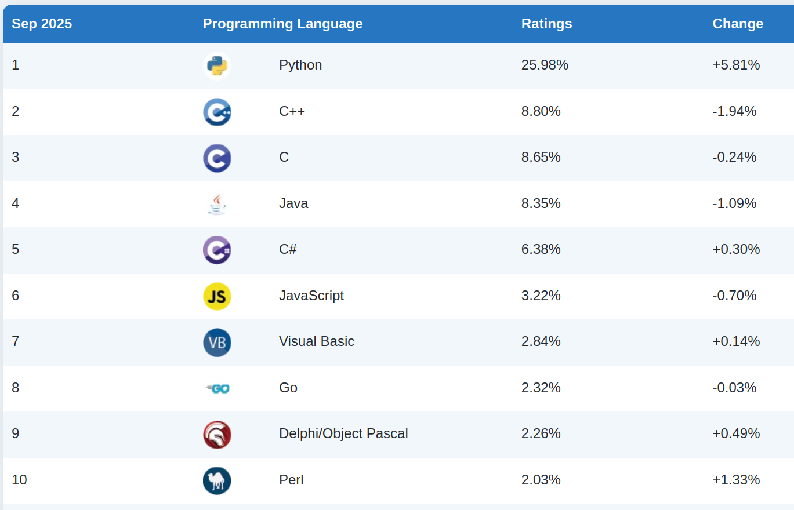
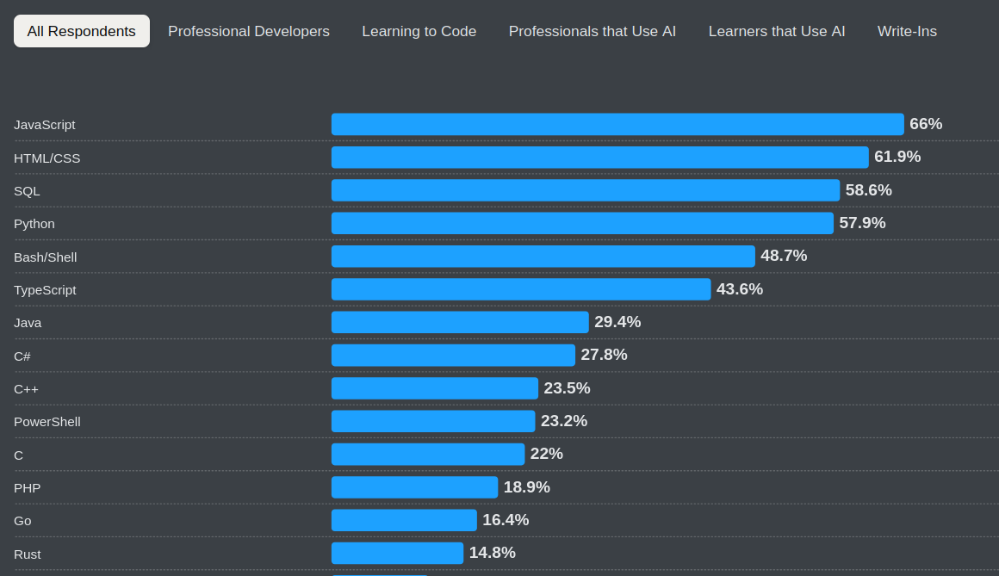
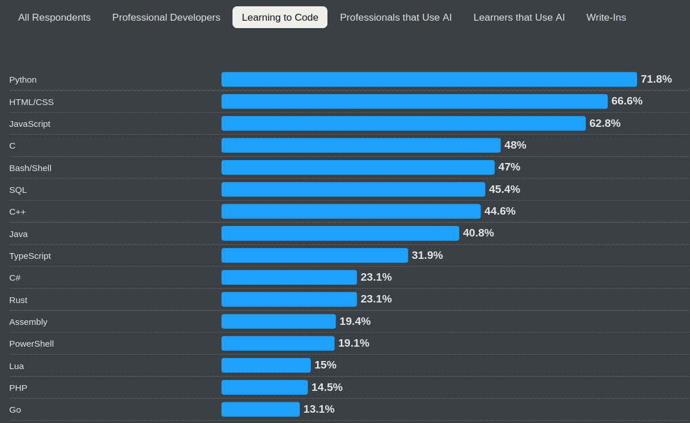

# Programování 01

## Úvod do programování

---

# Obsah

  1. O mně
  1. O předmětu
  1. O programování
  1. První krůčky a experimenty

---

# O mně

- RNDr. Ondřej Žára
- ondrej.zara@firma.seznam.cz
- ondrej.zara@cvut.cz
- https://ondras.zarovi.cz/

---

# Moje práce

- Seznam.cz, a.s.
  - E-mail, registrace a přihlašování, správa domén, kalendář, &hellip;
- ČVUT FEL
  - dva předměty o různých aspektech vývoje webových aplikací
- Dvě knihy o JavaScriptu

---

# O předmětu

- Povinný kurz programování i pro ty, kteří o něj příliš nestojí
- Přehlídka různých témat ze světa programátorů
- Jednou týdně přednáška&hellip;
  - &hellip;resp. cvičení
  - &hellip;resp. něco mezi
- Zakončeno zápočtem
  - &hellip;za aktivitu v hodině

---

# Náplň

- Jazyk Python a jeho praktické aplikace
- Sítě a webové aplikace (taktéž s využitím Pythonu)
- Správa zdrojových kódů
- Databáze
- Organizace vývoje aplikací
- Bezpečnost

---

# O programování

> Sepisování instrukcí pro stroje všech velikostí a zaměření

- Analýza a algoritmická formulace problému a řešení
- Způsob, jak si ušetřit čas
- Logická úloha, hádanka

---

# Robot a žárovky

Je tohle programování?

<tm-runtime skin="robot">
	<tm-rules editable states="1" symbols="2"></tm-rules>
	<tm-machine state="A" position="0"></tm-machine>
	<tm-tape initial="000000000" initial-offset="-4"></tm-tape>
	<tm-controls what="reset playpause"></tm-controls>
</tm-runtime>

---

# Robot a žárovky

Dvě barvy robota. Kolik žárovek dáte?

<tm-runtime skin="robot">
	<tm-rules editable states="2" symbols="2"></tm-rules>
	<tm-machine state="A" position="0"></tm-machine>
	<tm-tape initial="000000000" initial-offset="-4"></tm-tape>
	<tm-controls what="reset playpause"></tm-controls>
</tm-runtime>

---

# Kolik nejvíc žárovek?

&hellip;za předpokladu, že se zastaví

<table class=bb>
  <thead>
    <tr><th>Počet barev</th><th>Rozsvícených žárovek</th></tr>
  </thead>
  <tbody>
    <tr><td>1</td><td>1</td></tr>
    <tr class=reveal><td>2</td><td>4</td></tr>
    <tr class=reveal><td>3</td><td>6</td></tr>
    <tr class=reveal><td>4</td><td>13</td></tr>
    <tr class=reveal><td>5</td><td>4098 (dokázáno v roce 2024)</td></tr>
    <tr class=reveal><td>6</td><td></td></tr>
  </tbody>
</table>

---

# Pro zájemce: co jsme to tu dělali?

- Alan Turing
  - Matematik, logik, kryptoanalytik
  - Známý zejména v souvislosti s kryptoanalýzou Enigmy
  - Koncept Turingova stroje v článku *On Computable Numbers,* 1936

- Turingův stroj má hlavu, nekonečnou pásku a *přechodovou funkci* (tabulku)
  - Vhodné pro teoretické úvahy (algoritmizace, vyčíslitelnost)
  - Každý program lze převést na TS

---

# První krůčky

 {.maslo-poster}

---

# První krůčky

 {.maslo-poster}

---

# První krůčky

 {.maslo-poster}

---

# Volba jazyka

- &hellip;je jako volba pracovního nářadí
- často vázána na řešený problém
- jednoduchost zprovoznění
- sekundární omezení: podpora OS, výkon, dostupnost dokumentace a komunity

---

# Další čtení a zdroje

- ~~StackOverflow~~
- ~~ChatGPT~~
- Dokumentace (k jazyku, ve kterém programuji)
- Fórum/Discord (k jazyku, ve kterém programuji)
- YouTube tutoriály
- MDN Web Docs: https://developer.mozilla.org/

---

# Prostor pro otázky

? { .questions }
