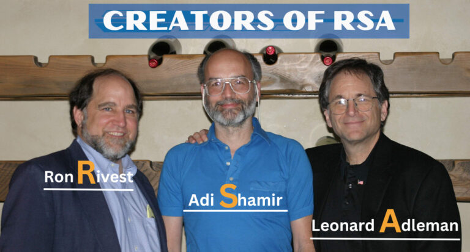

# Programování 11

## Bezpečnost a kryptografie

---

# Obsah

1. Bezpečnost informačních systémů
1. Vybrané partie z moderní kryptografie

---

# Bezpečnost informačních systémů

- Velmi široké téma
- Analýza rizik
- Zpracování (reakce) incidentů
- Bezpečnost vs. komfort (míra bezpečnosti není bool)

---

# Otázka za zlatého bludišťáka

*Proč je na Internetu tak nebezpečno?*

- Čím je systém složitější, tím více obsahuje potenciálních zranitelností
- Mnoho vrstev
- Lidský faktor (na straně programátorů, provozovatelů, uživatelů)

---

# Analýza rizik

- Vyhodnocení relevance: pravděpodobnost, závažnost
- Prevence vs. testování vs. zpětná analýza
- Zdaleka nejde jen o *chyby* v programech

---

# Kryptografie

Ta část bezpečnosti, která se věnuje ochraně informací před neoprávněným přístupem

1. Šifra
1. Asymetrická šifra
1. Otisk
1. Podpis
1. PKI

---

# Šifra

- plaintext + klíč = zašifrovaný text
  - (zašifrovaný - klíč = plaintext)
- `AHOJ + 13 = NUBW`
- Vigenèrova šifra: klíč má více znaků (a aplikuje se dokolečka)
- Vernamova šifra: klíč má tolik znaků, jako plaintext

---

# Kdopak to je?

 {.maslo-poster}

---

# Rivest, Shamir, Adleman

{height=300}

- Asymetrický algoritmus RSA, 1977
- Založený na klíčích, které vznikají násobením velkých prvočísel
- Bezpečnost stojí a padá na (ne)schopnosti faktorizace velkých čísel

---

# Asymetrická šifra

- Absolutně klíčový koncept moderní kryptografie
- Dvojice *provázaných* klíčů:
  - plaintext + klíč_1 = zašifrovaný text
  - zašifrovaný + klíč_2 = plaintext
- Diffie-Hellman, RSA, ECDSA a další

---

# Asymetrická šifra v praxi

Terminologie: jeden klíč je **veřejný** (public), druhý je **soukromý** (private)

## E-mail

- Píšu Tondovi: text zašifruju jeho veřejným klíčem, on si jej rozšifruje soukromým

## Autorství

- Napíšu článek: zašifruju soukromým klíčem a ukážu ostatním; každý ověří, že jsem autorem

---

# Otisk

Motivace: jak v databázi uložit heslo uživatele?

---

# Otisk

- Otisk = Hash
- Hashovací funkce: deterministická, jednosměrná, bezkolizní
- [MD5](https://md5.cz/), SHA1, SHA256, bcrypt, &hellip;
- `if hash(heslo) == ulozeny_hash:`
- Další vylepšení: solení, výpočetní složitost

---

# Podpis

**Podpis = šifra ( hash ( plaintext ) )**

## Autorství

- Napíšu článek a na konec přidám podpis. Každý ho přečte, zájemce může potvrdit autorství
- Kontrola toho, že data nebyla cestou pozměněna

---

# Šifrování HTTP

- Webový server mi data zašifruje, já je rozšifruju
- Ochrana proti man-in-the-middle?
    - Co když to samé udělá útočník uprostřed?
- Aby to fungovalo, musím mít jistotu, že data šifroval server (slepice-vejce)

---

# Certifikát

- Jak server prokáže, že je autorem dat?
    - Jak poznám, že použitý klíč patří majiteli webu?
- Cerfitikát: název domény + veřejný klíč + podpis
    - Veřejný klíč použiju pro rozkódování šifrovaných dat
	- Podpis toho, kdo certifikát vydal (prodal)

---

# PKI

Public Key Infrastructure / Chain Of Trust

1. Od www.zara.cz dostanu certifikát podepsaný privátním klíčem A.com
    - A.com ho vydal jen tomu, kdo potvrdil vlastnictví domény
1. Od A.com dostanu certifikát podepsaný priváním klíčem B.com
1. ...
1. Od Z.com dostanu ceritikát podepsaný klíčem, jehož veřejný klíč je vestavěný v mém webovém prohlížeči

---

# Prostor pro otázky

? { .questions }
