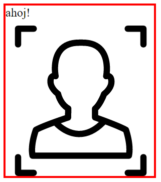

# KAJ 12: Web Components a CSS Nesting

FIXME nesting

---

# Obsah

  1. Custom Elements
  1. HTML Template Element
  1. Shadow DOM

---

# Příští přednáška je poslední

  - téma bylo zvoleno hlasováním
  - [výsledky](https://imgur.com/a/zNs8piX)

---

# Zkouška!

  - Odehrává se v Seznamu
    - Radlická 10, Praha 5
  - Výsledkem zkoušky je skóre v intervalu `<−10, 10>` bodů
  - První před-čtyř-termín: 26. 5. 2023 (9:00, 10:00, 11:00, 12:00)
  - Celkem 16 termínů
  - Další termíny budou vypsány jen v případě absolutní nouze

---

# Web Components

  - Souhrnný termín pro ~~čtveřici~~ trojici oddělených standardů
  - Fungují nezávisle, ale jsou cíleně navrhovány pro společné použití
  - Do roku ~2016 verze 0, od roku ~2016 znatelně odlišná verze 1; [výčet rozdílů](https://hayato.io/2016/shadowdomv1/)

---

# Custom Elements

  - Primární účel Web Components: vlastní HTML značky
  - Pomlčka v názvu = dopředná kompatibilita
  - Slušné zastoupení na webu: [graf](img/usage.png), github.com, youtube.com, &hellip;

---

# Custom Elements: ukázka použití

```html
<szn-map x="..." y="..." controls="keyboard mouse zoom pan" />
```

```js
let map1 = new SznMap({x:..., y:..., control: ...});
let map2 = document.createElement("szn-map");

document.body.append(map1);
map1.append(map2);
```

---

# Custom Elements: konkrétní ukázky

  - https://github.com/ondras/fixmetodo
  - https://github.com/ondras/instant-button
  - https://github.com/ondras/custom-range
  - https://github.com/ondras/cyp
  - https://www.zdrojak.cz/clanky/custom-elements-v-praxi/

---

# Custom Elements &ndash; define

  - JS API tvořeno jedinou funkcí: `customElements.define("szn-map", SznMap)`
  - Vlastní značky musí mít v názvu pomlčku (dopředná kompatibilita)
  - Značka s pomlčkou v názvu je tzv. *unresolved element* (`instanceof HTMLElement`), dokud nedojde k registraci

---

# Custom Element class

  - Třída (druhý parametr `customElements.define`) popisuje chování značky
  - Rozšiřuje (`extends`) nějakou existující HTML značku
  - Může obsahovat tzv. *lifecycle callbacks*

---

# Custom Elements: lifecycle callbacks

```js
class MyElement extends HTMLElement {
	constructor() { super() }
	attributeChangedCallback(name, oldValue, newValue) {}
	connectedCallback() {}
	disconnectedCallback() {}
	adoptedCallback() {}
}
```

---

# Custom Elements: událost

- Vzniklá značka je plnohodnotný člen ekosystému HTML
  - DOM API
  - Události
- Vlastní události lze vytvářet i *odpalovat*

```js
let event = new CustomEvent("toto-je-test", {bubbles:true})
myElement.dispatchEvent(event)
```

---

# HTML Template Element

Parsovaný, ale inertní HTML prvek

```html
<template>
	<div class="person"></div>
	<script>new Person(...)</script>
</template>
```

---

# HTML Template Element

```js
let template = document.querySelector("template")
let parent = document.body

parent.append(template.content.cloneNode(true))
```

---

# Custom Element + Template

```js
let template = document.querySelector("template")

class MyElement extends HTMLElement {
  constructor() {
    super()
    this.append(template.content.cloneNode(true))
  }
}
```

---

# Shadow DOM

  - Nástroj na řešení problému, nikoliv nezbytná součást Web Components
  - Myšlenka: DOM widgetu nemá okolí co zajímat
  - Technika *odstínění* podstromu od zbytku stránky
    - Skrytí podstromu v rámci DOM API
    - Obousměrná izolace CSS selektorů

---

# Shadow DOM: koncept

  - Pro libovolný uzel DOMu lze vytvořit tzv. *shadow root* (potomek DocumentFragment)
  - Shadow root může obsahovat libovolně složitý podstrom
  - Shadow root není vidět (JS DOM), ale je vidět (render)
  - Omezení JS událostí, omezení aplikace CSS selektorů
  - [Dokumentace](https://developer.mozilla.org/en-US/docs/Web/Web_Components/Using_shadow_DOM)

---

# Shadow DOM: ukázka

```js
class MyElement extends HTMLElement {
  constructor() {
    super()
    this.attachShadow({mode: "open"})
    this.shadowRoot.innerHTML = `
      <style>
        img { border: 3px solid blue }
      </style>`
  }
}
customElements.define("my-element", MyElement)

new MyElement().childNodes.length  // 0
```

---

# Shadow DOM: problémy

Shadow DOM je trade-off: některé problémy vyřeší, jiné způsobí

1. Co když chceme do prvku se Shadow DOM přidávat potomky?
1. Co když je CSS izolace příliš silná (směrem dovnitř)?

---

# Shadow DOM: potomci

  - Existují v rámci JS DOM, ale nejsou vidět (!)
  - Dualita podstromů Shadow DOM (vidím) vs. Light DOM (tvořím)
  - Autor značky musí rozhodnout, co s takto připojenými potomky

---

# Shadow DOM: &lt;slot&gt;

  - Nová HTML značka užitečná jen uvnitř Shadow DOM
  - Připínání potomků do uzlu se Shadow rootem způsobí jejich *(re)distribuci*
  - `<slot>` určuje místo, ve kterém se Light DOM vykreslí
  - Uživatel appenduje do Shadow host, renderer vykresluje do `<slot>`
  - Jeden Shadow DOM může mít více značek `<slot>`
  - [Dokumentace](https://developer.mozilla.org/en-US/docs/Web/API/Web_components/Using_templates_and_slots)

---

# Shadow DOM: &lt;slot&gt;

 {.side}

```js
class MyAvatar extends HTMLElement {
  constructor() {
    super()
    this.attachShadow({mode:"open"})
    this.shadowRoot.innerHTML = `
      <slot></slot>
      
    `
  }
}

new MyAvatar().append("ahoj!")
```


---

# Shadow DOM: stylování

Několik způsobů *proražení* Shadow rootu

1. Vlastnosti s hodnotou `inherit` (tj. mj. Custom CSS Properties)
1. Selektor `:host()`
1. Selektor `::part()`

---

# Shadow DOM: dědění CSS

Shadow DOM:
```css
img {
  border: 3px solid var(--border-color)
}
```

Stránka:
```css
my-element {
  --border-color: blue
}
```

---

# Shadow DOM: :host()

Shadow DOM:
```css
:host(.dark-mode) img {
  border: 3px solid white
}
```

Stránka:
```html
<my-element class="dark-mode"></my-element>
```

---

# Shadow DOM: ::part()

Shadow DOM:
```js
this.shadowRoot.innerHTML = `
  
`
```

Stránka:
```css
my-element::part(obrazek) {
  border: 3px solid blue
}
```

---

# Web Components: další čtení

- https://custom-elements-everywhere.com/
- [Debunking Web Component Myths and Misconceptions](https://eisenbergeffect.medium.com/debunking-web-component-myths-and-misconceptions-ea9bb13daf61)
- [Awesome Web Components](https://github.com/web-padawan/awesome-web-components) (přes 500 odkazů na zdroje)
- [Apple Just Shipped Web Components to Production and You Probably Missed It](https://dev.to/ionic/apple-just-shipped-web-components-to-production-and-you-probably-missed-it-57pf)
- [Custom Elements v1 - Reusable Web Components](https://web.dev/custom-elements-v1/)

---

# Prostor pro otázky

? {.questions}
