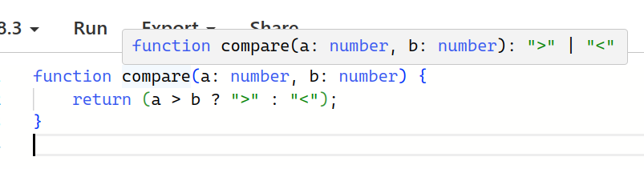

# KAJ 13: TypeScript

---

# Obsah

1. Preprocessing JS a TypeScript
1. Hlavní vlastnosti a syntaxe
1. TSC
1. Další implementace a užití
1. Server-side JS/TS

---

# Preprocessing JS

- Populární cca 2005-2015
- Doplnění/vylepšení syntaxe: CoffeeScript, ClojureScript, Elm, BuckleScript&hellip;
- Doplnění typových informací: Flow, TypeScript
  - Úkol: statická typová kontrola

---

# TypeScript

- Microsoft, 2012 (Anders Hejlsberg)
- Nadmnožina syntaxe JS
- Nejen formální specifikace jazyka!
  - Také oficiální kompilátor
  - Také typové informace k populárním knihovnám 3. stran
  - Také tooling pro editory/IDE
  - Také zázemí a podpora silné společnosti
- Projekt stále rozvíjen

---

# TypeScript

https://www.typescriptlang.org/

```ts
function add(a: number, b: number) {
	return a+b;
}

add(1, "2")
```

```
> Argument of type 'string' is not assignable to parameter of type 'number'.
```

---

# Syntaxe a vlastnosti jazyka

Typy proměnných, parametrů a návratových hodnot

```ts
function compare(a: number, b: number): string {
	let result: string = "";
	result = a > b ? ">" : "<";
	return result;
}
```

---

# Syntaxe a vlastnosti jazyka

**Inference:** schopnost domyslet typové informace z použité syntaxe

```ts
function compare(a: number, b: number) {
	return (a > b ? ">" : "<");
}
```



---

# Syntaxe a vlastnosti jazyka

Pole, struktury, volitelné klíče

```ts
let numbers1: number[] = [1, 2, 3];
let numbers2: Array<number> = [4, 5, 6];

type Person = {
	name: string;
	surname?: string;
}

let p1: Person = { name: "Eva" }
let p2: Person = { name: "Jiří", surname: "Novák" }
```

---

# Syntaxe a vlastnosti jazyka

Sjednocení typů

```ts
function greet(who: string | Person) {
	if (typeof(who) == "string") {
		alert(who)
	} else {
		alert(who.name)
	}
}
```

---

# Syntaxe a vlastnosti jazyka

Generika (parametrické typy)

```ts
function first<T>(arr: T[]) {
	return arr[0]
}
let num = first([1, 2, 3])

let button = document.createElement("button")
button.value = "name"

let span = document.createElement("span")
span.value = "name" // Property 'value' does not exist on type 'HTMLSpanElement'
```

---

# Syntaxe a vlastnosti jazyka

Externí typové deklarace

```ts
declare function sum(a: number, b: number): number;
```

- Uložit do souboru `foo.d.ts`
- Automaticky použito při načtení `foo.js`
- Poskytnutí typů *bokem* tam, kde nemůžeme nebo nechceme zasahovat do existujícího kódu
- Typicky pro externí knihovny
- K nezaplacení při práci s DOM

---

# Životní cyklus TS kódu

1. tvorba a údržba
    - užitečná podpora v editoru/IDE
1. kontrola a kompilace
    - zahrnuje odstranění nadbytečných (typových) informací
1. běh
    - žádný TS, jen JS

---

# TSC

- TypeScript Compiler
- Referenční implementace
- Typicky dostupný z NPM
  - `npm install -g typescript`
  - https://www.typescriptlang.org/play

---

# TSC: Role

- Kontrola
  - jednorázová, typicky vyvolaná vývojářem
- Komplilace
  - odstranění typových anotací
  - **výjimečně** doplnění nového runtime kódu
  - transpilace
- Kontrola
  - průběžná, typicky iniciovaná editorem
  - API pro komunikaci editor &harr; tsc (Language Server)

---

# TSC a JS

TSC dává smysl i při psaní běžného JavaScriptu!

- Silný systém **typové inference**
- Alternativně podpora typování pomocí dokumentačních komentářů (JSDoc)
- Ideální pro inkrementální zavádění TS

---

# TSC: Konfigurace

TSC je ultimátní nástroj pro TS, vybavený spoustou konfigurovatelných nastavení.

- Míra striktnosti
- Závažnost jednotlivých chyb
- Kterým souborům/adresářům se věnovat
- Module resolution
- Verze výstupní syntaxe
- Doplňkové kontroly (nepoužité proměnné, switch fallthrough, nedostupný kód&hellip;)

---

# TSC: Použití

tsconfig.json:
```json
{
  "compilerOptions": {
    "strict": false,
    "noImplicitAny": true,
    "removeComments": true
  },
  "files": ["app.ts", "lib.ts"]
}
```

```sh
$ tsc -p tsconfig.json
```

---

# TSC: Doplňkové informace

- Stejná verze a konfigurace pro editor a kompilaci/bundling
- Někdy obtížná spolupráce s knihovním kódem
- Někdy obtížná spolupráce s různými formami modularizace (globals / require / import)

---

# Další implementace

- TSC je velký a silný nástroj&hellip;
- &hellip;a je také přiměřeně pomalý
- Existují alternativní implementace pro TS kompilaci (nikoliv však pro typovou kontrolu)
  - [ESBuild](https://esbuild.github.io/) (Go)
  - [SWC](https://swc.rs/) (Rust)
  - [Babel](https://babel.dev/) (TypeScript)
  - [Sucrase](https://sucrase.io/) (modernější fork Babelu)

---

# Server-side JS/TS

- Proč by měl být JS k dispozici jen v prohlížeči?
- Paradigma asynchronního I/O na serveru
- Sdílení kódu
- *Snadnost* rozšířeného jazyka

---

# Status quo

 {.maslo-poster}

---

# Status quo: Node.js a Deno

 {.maslo-poster}

---

# Status quo: Node.js a Deno a Bun

 {.maslo-poster}

---

# Koncepty server-side JS/TS

- Jako v prohlížeči, akorát bez DOM
- API pro *ty ostatní věci*: filesystem, síť, další periferie
  - Bez oficiální standardizace
  - Problém při průniku s klientskou stranou

---

# Node.JS

- 2009, Ryan Dahl
- C++, V8
- Z pohledu klientského JS velmi starý
- Pre-Promise APIs
- Ruku v ruce s NPM
- TS až nedávno, pouze implicitní odstranění typů

---

# Deno

- 2018, Ryan Dahl (!)
- Rust, V8
- *Jako Node.js, ale lepší*
  - Single binary
  - Žádný `package.json`
  - TS od začátku (kontrola, odstranění typů, Language Server)
  - Snaha o znovupoužití klientských APIs

---

# Bun

- 2021, Jarred Sumner
- Zig, JavaScriptCore
- Primární zaměření na výkon

---

# Prostor pro otázky
